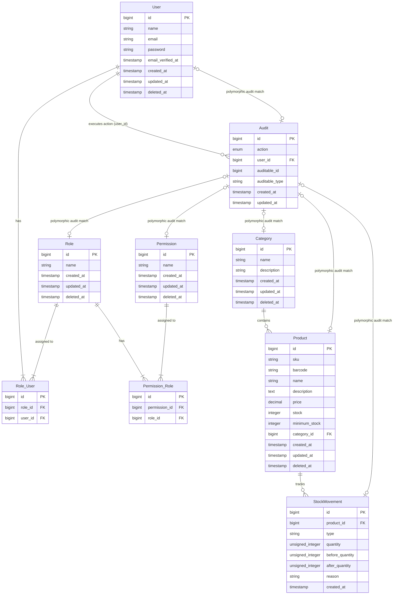

# Inventory API

[](https://github.com/SirCesarium/inventory-api/actions/workflows/ci.yml)
[](https://github.com/SirCesarium/inventory-api/blob/main/LICENSE)

**REST API for product inventory management with role-based access control and audit trail.**

Inventory API is a Laravel backend that exposes CRUD operations for products, categories, users, roles, and permissions. Authentication happens via Sanctum tokens. Access is gated by a role-permission matrix where admins bypass all checks, managers and employees get scoped access.

Built for small-to-medium inventory workflows where you need a structured API without the overhead of a full ERP.

## Stack

Laravel, Sanctum (token auth), Pest (tests), SQLite/MySQL/PostgreSQL.

## Setup

```bash
composer install
cp .env.example .env
php artisan key:generate
php artisan migrate --seed
php artisan serve
```

The seeder creates three roles (`admin`, `manager`, `employee`), and permissions are dynamically generated from `config/permissions.php`. A default admin user is also created.

### Default credentials

| Email               | Password | Role  |
| ------------------- | -------- | ----- |
| admin@inventory.api | admin    | admin |

## API overview

All endpoints live under `/api`. Authenticated routes return 401 without a valid token. Authorized routes return 403 if the user lacks the required permission.

### Auth

| Method | Path             | Auth | Description                           |
| ------ | ---------------- | ---- | ------------------------------------- |
| POST   | /login           | No   | Returns Bearer token                  |
| POST   | /logout          | Yes  | Revokes current token                 |
| GET    | /me              | Yes  | Current user profile                  |
| POST   | /change-password | Yes  | Updates authenticated user's password |

Login is rate-limited to 5 requests per minute per email+IP combo. Authenticated routes are limited to 100 requests per minute per user (or per IP for anonymous requests).

### Categories

| Method | Path                   | Permission        | Description                          |
| ------ | ---------------------- | ----------------- | ------------------------------------ |
| GET    | /categories            | —                 | List (paginated, with product count) |
| POST   | /categories            | manage-categories | Create                               |
| GET    | /categories/{id}       | —                 | Get (with product count)             |
| PUT    | /categories/{id}       | manage-categories | Update                               |
| DELETE | /categories/{id}       | manage-categories | Soft delete (409 if has products)    |
| DELETE | /categories/{id}/force | manage-categories | Hard delete                          |

### Products

| Method | Path                 | Permission      | Description                         |
| ------ | -------------------- | --------------- | ----------------------------------- |
| GET    | /products            | —               | List (paginated, includes category) |
| POST   | /products            | manage-products | Create                              |
| GET    | /products/{id}       | —               | Get (includes category)             |
| PUT    | /products/{id}       | manage-products | Update                              |
| DELETE | /products/{id}       | manage-products | Soft delete                         |
| DELETE | /products/{id}/force | manage-products | Hard delete                         |

### Users

| Method | Path                       | Permission   | Description                         |
| ------ | -------------------------- | ------------ | ----------------------------------- |
| GET    | /users                     | manage-users | List (paginated, includes roles)    |
| POST   | /users                     | manage-users | Create (password defaults to email) |
| GET    | /users/{id}                | manage-users | Get (includes roles)                |
| PUT    | /users/{id}                | manage-users | Update                              |
| DELETE | /users/{id}                | manage-users | Soft delete                         |
| DELETE | /users/{id}/force          | manage-users | Hard delete                         |
| POST   | /users/{id}/roles/{roleId} | manage-users | Attach role                         |
| DELETE | /users/{id}/roles/{roleId} | manage-users | Detach role                         |

### Roles

| Method | Path                             | Permission   | Description                            |
| ------ | -------------------------------- | ------------ | -------------------------------------- |
| GET    | /roles                           | manage-roles | List (paginated, includes permissions) |
| POST   | /roles                           | manage-roles | Create                                 |
| GET    | /roles/{id}                      | manage-roles | Get (includes permissions)             |
| PUT    | /roles/{id}                      | manage-roles | Update                                 |
| DELETE | /roles/{id}                      | manage-roles | Soft delete                            |
| DELETE | /roles/{id}/force                | manage-roles | Hard delete                            |
| POST   | /roles/{id}/permissions/{permId} | manage-roles | Attach permission                      |
| DELETE | /roles/{id}/permissions/{permId} | manage-roles | Detach permission                      |

### Permissions

| Method | Path                    | Permission         | Description                      |
| ------ | ----------------------- | ------------------ | -------------------------------- |
| GET    | /permissions            | manage-permissions | List (paginated, includes roles) |
| POST   | /permissions            | manage-permissions | Create                           |
| GET    | /permissions/{id}       | manage-permissions | Get (includes roles)             |
| PUT    | /permissions/{id}       | manage-permissions | Update                           |
| DELETE | /permissions/{id}       | manage-permissions | Soft delete                      |
| DELETE | /permissions/{id}/force | manage-permissions | Hard delete                      |

### Audits

| Method | Path         | Permission  | Description                                   |
| ------ | ------------ | ----------- | --------------------------------------------- |
| GET    | /audits      | view-audits | List (paginated, includes user and auditable) |
| GET    | /audits/{id} | view-audits | Get (includes user and auditable)             |

Audits are created automatically via an Eloquent observer on every model create, update, and delete.

### Stock Movements

| Method | Path                          | Permission       | Description                                       |
| ------ | ----------------------------- | ---------------- | ------------------------------------------------- |
| GET    | /movements                    | movements.read   | List (paginated, includes product)                |
| GET    | /movements/{id}               | movements.read   | Get (includes product)                            |
| POST   | /products/{product}/movements | movements.create | Register stock movement (`in`/`out`/`adjustment`) |

Stock movements track product inventory changes. An `in` movement increases stock, `out` decreases it (returns 409 if insufficient stock), and `adjustment` sets an absolute value. Movements are append-only — they cannot be updated or deleted. The stock change is applied atomically when the movement is created.

### Product fields

| Field         | Type                      | Description                       |
| ------------- | ------------------------- | --------------------------------- |
| barcode       | string (unique, nullable) | Product barcode (ISBN, UPC, etc.) |
| minimum_stock | integer (default 0)       | Threshold for low-stock alerts    |

### Pagination

All list endpoints accept `?per_page=` (1–100, default 15). Response follows the standard Laravel paginated structure with `data`, `current_page`, `last_page`, `total`, etc.

## Authorization model



- **admin**: Bypasses all permission checks. Has every ability.
- **manager**: Scoped to `products.*`, `categories.*`, `movements.*`, `audits.read`.
- **employee**: Scoped to `products.read`, `categories.read`.

Permissions are checked via Laravel's `Gate::before` hook. The admin role is identified by name. Non-admin users are checked against their role-permission relationship.

## Soft deletes

Every resource model uses `SoftDeletes`. A standard `DELETE` sets `deleted_at` and the record becomes invisible to normal queries. The `/force` variant calls `forceDelete()` and removes the row permanently.

Category deletion is blocked (409) if the category still has associated products.

## Demo mode

Set `APP_DEMO=true` to switch the API into read-only mode. In this mode:

- GET, HEAD, OPTIONS, and POST `/login` pass through
- All other mutating requests return `403 Demo mode — read only.`
- The `DatabaseSeeder` uses `DemoSeeder` (pre-populated sample data) instead of `ProductionSeeder`
